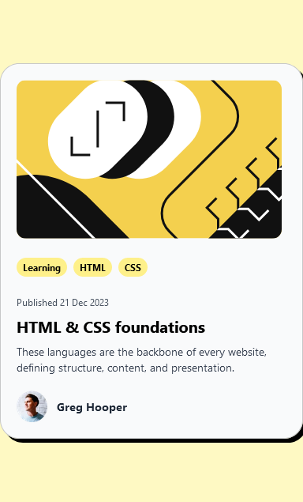

# Frontend Mentor - Blog preview card solution

This is a solution to the [Blog preview card challenge on Frontend Mentor](https://www.frontendmentor.io/challenges/blog-preview-card-ckPaj01IcS). Frontend Mentor challenges help you improve your coding skills by building realistic projects. 

## Table of contents

- [Overview](#overview)
  - [The challenge](#the-challenge)
  - [Screenshot](#screenshot)
  - [Links](#links)
  - [Built with](#built-with)

## Overview

### The challenge

Users should be able to:

- See hover and focus states for all interactive elements on the page

### Screenshot

### Links

- Solution URL: [Here](https://github.com/keyule/Frontend-Mentor-Blog-Preview-Card)
- Live Site URL: [Here](https://keyule.github.io/Frontend-Mentor-Blog-Preview-Card/)

### Built with

- [React](https://reactjs.org/) - JS library
- Tailwind
